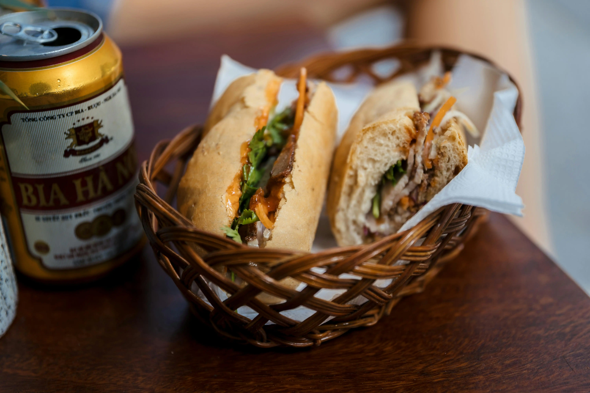

# Một blog khá đơn giản
duykhanh471

## Giới thiệu
Đây là một trang Blog cá nhân của duykhanh471. Do mình đang trong quá trình thiết kế Website, và có ý tưởng muốn đưa bài viết này lên nên mình đã làm luôn một trang thật đơn giản này.

Mình cũng là thằng cha viết các thứ ở bên [Khu học mở](https://daihocmo.github.io/) (Khu tổng hợp rất nhiều thứ liên quan đến tự học và phát triển bản thân, nhiều thứ lắm chắc vậy).
 
## Chuyên mục
Choose one that makes you curious and then just read it (if you want to).

| =========== | =========== | =========== | =========== |
| --- | --- | --- | --- |
|[Cập nhật](./bai-viet/cap-nhat/index.md) | [Học tập](./bai-viet/hoc-tap/index.md) | [Đọc sách](./bai-viet/doc-sach/index.md) | [Suy tưởng](./bai-viet/suy-nghi/index.md) |
| [Dự án](./bai-viet/du-an/index.md) | [Lập trình](./bai-viet/lap-trinh/index.md) | [Sở thích](/bai-viet/so-thich/index.md) | [Tu luyện](./bai-viet/ren-luyen/index.md) |

## Còn gì khác
Làm một bữa sáng

